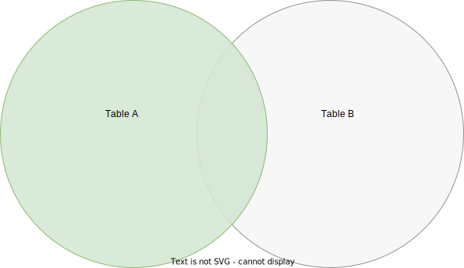
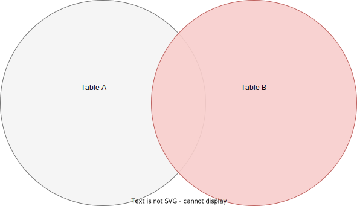

### 1. Create customers And orders Table in relation_legacy Database

```sql
USE relation_legacy;

CREATE TABLE customers (
	id INT AUTO_INCREMENT PRIMARY KEY,
    first_name VARCHAR(25),
    last_name VARCHAR(25),
    email VARCHAR(60)
);

CREATE TABLE orders (
	id INT AUTO_INCREMENT PRIMARY KEY,
    order_date DATE,
    amount DECIMAL(6, 2),
    customer_id INT,
    FOREIGN KEY (customer_id) REFERENCES customers(id)
);

INSERT INTO customers (first_name, last_name, email)
VALUES('Boy', 'George', 'george@gmail.com'),
    ('George', 'Michael', 'michael@gmail.com'),
    ('David', 'Bowie', 'david@gmail.com'),
    ('Blue', 'Steele', 'blue@gmail.com'),
    ('Bette', 'Davis', 'bette@gmail.com');


INSERT INTO orders (order_date, amount, customer_id)
VALUES('2016/02/10', 99.99, 1),
    ('2017/11/11', 35.50, 1),
    ('2014/12/12', 800.67, 2),
    ('2015/01/03', 12.50, 2),
    ('1999/04/11', 450.25, 5);
```

### 2. What is Inner Join

```html
Inner join takes everything common between table A & table B
```


### 2.1. Implicit Inner Join

```sql
SELECT * from customers, orders WHERE customers.id = orders.customer_id;
```

### 2.2. Explicit Inner Join

```sql
SELECT * from customers JOIN orders ON customers.id = orders.customer_id;
```

### 2.3 Fancier Example

```sql
SELECT first_name, last_name, SUM(amount) AS total_spent FROM customers JOIN orders ON customers.id = orders.customer_id GROUP BY orders.customer_id ORDER BY total_spent DESC;
```

### 3. What is Left Join

```html
Select everything from A, along with any matching records in B
```



```sql
SELECT * FROM customers LEFT JOIN orders ON customers.id = orders.customer_id;
```

```sql
SELECT first_name, last_name, IFNULL(SUM(amount), 0) AS total_spent FROM customers LEFT JOIN orders ON customers.id = orders.customer_id GROUP BY customers.id ORDER BY total_spent;
```

### 4. What is Right Join

```html
Select everything from B, along with any matching records in A
```



```sql
SELECT * FROM customers RIGHT JOIN orders ON customers.id = orders.customer_id;
```

```sql
SELECT first_name, last_name, IFNULL(SUM(amount), 0) AS total_spent FROM customers RIGHT JOIN orders ON customers.id = orders.customer_id GROUP BY customers.id ORDER BY total_spent;
```

### 5 DELETE CASCADE

<b>Note:-</b> DELETE CASCADE delete the orders when we delete customers

```sql
CREATE TABLE customers (
	id INT AUTO_INCREMENT PRIMARY KEY,
    first_name VARCHAR(25),
    last_name VARCHAR(25),
    email VARCHAR(60)
);

CREATE TABLE orders (
	id INT AUTO_INCREMENT PRIMARY KEY,
    order_date DATE,
    amount DECIMAL(6, 2),
    customer_id INT,
    FOREIGN KEY (customer_id) REFERENCES customers(id)
    ON DELETE CASCADE
);
```
